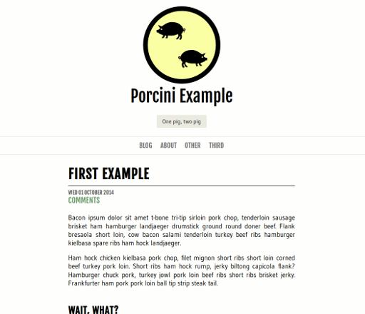

# Porcini for Pelican

This is Porcini. It is heavily inspired by Chunk which is a "faithful as
possible" translation of Chunk-wpcom v1.0 for Pelican 3. Heavily inspired means
Chunk was used as base and remorselessly refactored, cleaned up, extended,
chopped and mutilated.

I am not a web-head or CSS guru, if you are, your help is warmly welcome: if
you see crazy and/or stupid things please submit a patch.

## Browser Compatibility

This theme was only really tested with Firefox (PC, Android) and Chrome
(Android) and looked as it should.

In any case, there aren't any really fancy CSS gimmics used so modern browsers
should mostly work fine.

## Commenting System

Disqus support is included.

## Settings used by this theme (All Optional)

* `DEFAULT_DATE_FORMAT = ('%b %d %Y')` : suggested date format
* `SITESUBTITLE = 'String'`
* `FOOTER_TEXT = 'Powered by <a href="http://pelican.readthedocs.org">Pelican</a>, theme is called Porcini.'`
* `DISPLAY_CATEGORIES_ON_MENU = True/False`
* `LINKS = (('Site', 'http://url.com'), ('Site 2', 'http://another.url.com'))`
* `SINGLE_AUTHOR = True/False`
* `MINT = True/False`
* `GOOGLE_ANALYTICS = 'Put your Google code here'`

Note: Mint is untested, I don't use it, but it was included with Chunk so I kept it in.

## Motivation

Motivation for making this theme was I wanted a theme for my blog but couldn't
find a theme which I liked a lot. Chunk was closest but not close enough, so I
went from Chunk onwards. Because of this history, this theme is also GPLv2.

Main design concerns for me:

* readability, like a book/magazine
* scales nicely (PCs, phones, tablets, ...)
* looks "nice" i.e. doesn't look like a complete crock of shit

The theme is not "responsive" per se, though will be mostly fine with display
widths >= 320 pixels. For most users this should be OK.

## A Humble Plea

A humble plea to all awesome web developers: please create more templates for Pelican!

## Screenshot

## Credits

### Authors

* [Jani Nurminen](http://kippura.org) (Porcini for Pelican)
* [tBunnyMan](http://bunnyman.info) (Chunk for Pelican v1.0)
* [Tran N (thisistran) on Twitter](http://twitter.com/#!/thisistran) (Original Wordpress theme)

## Licence

The theme .css and template files are modified and released under the GNU
General Public License v2, full details in `LICENSE.txt` file.

### Original comments from Chunk

    /*
    Theme Name: Chunk
    Theme URI: http://theme.wordpress.com/themes/chunk/
    Author: Automattic
    Author URI: http://automattic.com
    Description: A straightforward theme with bold typography designed by <a href="http://twitter.com/#!/thisistran/">Tran N</a>. Featuring multiple post formats, custom background, custom menu, and custom header. Also comes with an optional footer widget area.
    Version: 1.0-wpcom
    License: GNU General Public License
    License URI: license.txt
    Tags: light, white, fixed-width, one-column, custom-background, custom-header, custom-menu, post-formats, rtl-language-support, sticky-post, translation-ready, art, blog, cartoon, holiday, journal, lifestream, photography, tumblelog, bright, clean, contemporary, flamboyant, modern
    */

